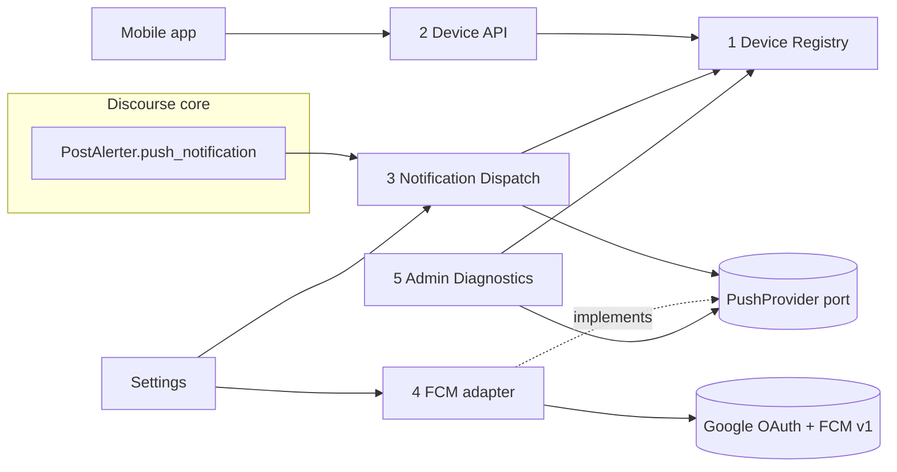

# mobile-push-v1

> Version 1.0 of the generic Discourse mobile push plugin: device registration API, delivery of Discourse push notifications to registered devices via FCM HTTP v1, self-healing delivery, deep-link payloads, and basic admin diagnostics (proposal section 43), built in vertical slices.

## Decisions Log

<!-- Add new at bottom. Never remove. -->

| Date | Decision | Reasoning | Alternatives Considered |
|------|----------|-----------|------------------------|
| 2026-10-01 | [Entry] Start at Level 1 (Capabilities), with a deep Level 3 for the Firebase integration | New third-party integration spanning several components (design-first calibration) | Start at Level 2 treating the proposal as agreed capabilities |
| 2026-10-01 | Blueprint covers full v1.0 scope (proposal section 43), implemented as vertical slices starting with the section 44 milestone | Avoids redesign between milestone and v1.0 while keeping delivery incremental | Blueprint only the first milestone |
| 2026-10-01 | [Level 1] Approved five capabilities: register devices, receive pushes, open content, self-healing delivery, admin configuration and diagnostics (incl. device browser and test send) | Matches proposal section 43; test send is the main diagnostic path | Simpler admin capability limited to dashboard problem check and logs |
| 2026-10-01 | [Level 1] No legacy `discourse-fcm-notifications` compatibility endpoint; Tziburia migrates to `POST /mobile-push/v1/devices` | Keeps the plugin generic; avoids a state-changing GET that bypasses CSRF; the app needs an update anyway to send app_id/version | Compatibility endpoint mimicking `GET /fcm_notifications/automatic_subscribe` |
| 2026-10-01 | [Level 1] Out of scope for v1.0: per-user push preferences, iOS-specific behaviour, collapsing, automatic stale-device cleanup (last-seen recorded only), multiple providers/projects, topic subscriptions | Proposal section 43 "later versions"; establish reliable delivery first | Include some of these in v1.0 |
| 2026-10-01 | [Level 2] Five components plus a Settings edge: Device Registry, Device API, Notification Dispatch, Push Provider (FCM adapter), Admin Diagnostics | Each has a confirmed need and >1 caller; maps 1:1 onto the hexagonal layers | Merge Device API into Device Registry (rejected: fat controller, admin test send needs registry without HTTP); fold Settings into FCM adapter (rejected: PayloadBuilder also needs settings) |
| 2026-10-01 | [Level 2] Diagnostics stored as per-device columns (last delivered, last failure, failure reason) plus a per-site summary in Redis (last success, last failure, last config error, invalidated count); no delivery history table | Answers every proposal section 18 question cheaply; proposal 47.6 favours lightweight logging | Dedicated `mobile_push_deliveries` history table (write per push, retention job, beyond v1.0) |
| 2026-10-01 | [Level 2] Notification hook is `DiscourseEvent :push_notification` (fired by `PostAlerter.push_notification` for post and chat alerts, after do-not-disturb, before push filters); the listener applies `push_notification_filters` itself | Canonical core push channel; covers chat; respects core push rules | `:post_notification_alert` (deprecated, posts only); Notification model callbacks (would duplicate notification rules) |
| 2026-10-01 | [Level 3] One delivery job per device, retried by Sidekiq's built-in exponential backoff on `retryable` outcomes | Retries can never duplicate a successful send; simplest retry semantics | One fan-out job per notification that re-enqueues only failed devices (custom bookkeeping, duplicate risk) |
| 2026-10-01 | [Level 3] Logout: the app unregisters (by id or by token); re-registration of a token by another user transfers ownership. Credential-linked auto-removal deferred | Matches proposal section 37; generic; no coupling to Discourse auth internals | Tie devices to the session token / User API key and remove on revocation |
| 2026-10-01 | [Level 3] Registration matching order: by token (update, transfer owner), else by (user, app_id, device_identifier) (token refresh), else create then evict least-recently-seen beyond the per-user cap | Idempotent registration; handles token rotation and shared devices | Unique on (user, app_id, platform) only (breaks multiple installs) |
| 2026-10-01 | [Level 3] Pushes are sent immediately; core's `push_notification_time_window_mins` delay is not mirrored | Mobile apps expect prompt delivery; keeps dispatch simple | Delay while the user is active on the site, like core web push |
| 2026-10-01 | [Level 3] FCM classification: 200 delivered; 404 UNREGISTERED and 400 INVALID_ARGUMENT naming `message.token` invalid_device; other 400 rejected; 401 refresh token and retry once then config_error; 403 PERMISSION_DENIED / SENDER_ID_MISMATCH / THIRD_PARTY_AUTH_ERROR config_error (never deletes devices); 429 retryable honouring Retry-After; 5xx/timeouts retryable | Follows Firebase error-code docs and proposal sections 12 and 20 | Delete tokens on any 400; treat SENDER_ID_MISMATCH as invalid_device (would wipe devices on project misconfig) |
| 2026-10-01 | [Level 3] Admin test send runs synchronously with tight timeouts through DeliveryService, and is recorded in the staff action log | Admin needs immediate feedback; same outcome handling as normal delivery; audit trail | Enqueue the test send and poll for its result |
| 2026-10-01 | [Level 4] Discourse alert payload keys are read only by `AlertMapper` (inbound adapter), producing a core `Alert` value object; `PayloadBuilder` works on `Alert` | Keeps PostAlerter/chat payload coupling in one adapter (architecture ambiguity signal resolved) | PayloadBuilder reading the raw payload hash |
| 2026-10-01 | [Level 4] Request field and column named `token` (not `fcm_token` / `registration_token`) | Provider-neutral naming per proposal section 17 | Proposal's `fcm_token` / `registration_token` |
| 2026-10-01 | [Level 4] Push `data` carries identifiers and an absolute `url` only, never post text; privacy mode affects title/body only. Full-mode titles reuse core `discourse_push_notifications.popup.*` translations | No text leaks via data; consistent, already-translated wording across locales | Plugin-owned title strings; including excerpt/username in data |
| 2026-10-01 | [Level 4] Mobile auth resolved: any standard Discourse auth via `ensure_logged_in` (session cookie + CSRF, User API keys, admin API keys), plus a `discourse-mobile-push:devices` User API key scope covering the device endpoints | Works for WebView apps (Tziburia) and native apps with narrowly scoped keys | Session only; no plugin-specific scope |
| 2026-10-01 | [Level 4] Admin JSON endpoints live under `/admin/mobile-push/...` (separate from the Ember page path `/admin/plugins/discourse-mobile-push/...`) | Avoids route clashes with the admin plugin page | JSON under `/admin/plugins/discourse-mobile-push/...` |
| 2026-10-01 | Requirement drift vs proposal: `fcm_token`/`registration_token` -> `token`; settings renamed to `mobile_push_*`, project id optional, added max devices / allowed app ids / high-priority types; added `DELETE /devices {token}`; invalid tokens always deleted. Not written to the proposal (user choice) | Provider neutrality (s17), Discourse conventions, validation, priority policy (s26), logout (s37), data minimisation (s22) | Record overrides in the proposal document |
| 2026-10-01 | Design approved at Level 4. Status set to approved -- ready for implementation. | All four levels approved and persisted; traceability verified | -- |
| 2026-10-01 | Design review (review-log 2026-10-01) reopened Levels 3 and 4; status back to draft pending re-approval | 2 critical and 5 warning findings change approved flows/contracts | Defer findings to implementation |
| 2026-10-01 | [Level 3 rev] Registration: when the matched row would collide with another row holding (user, app_id, device_identifier), delete that stale row in the same transaction; concurrent inserts rescued (`RecordNotUnique`) and retried once as an update | Prevents 500s on shared devices and on simultaneous start-up/refresh registrations | Leave unique violations to surface as errors |
| 2026-10-01 | [Level 3 rev] User lifecycle: `mobile_push_devices.user_id` FK with ON DELETE CASCADE; devices deleted on `:user_anonymized` | Account deletion must not fail or retain push tokens (proposal s22) | No FK and rely on cleanup job; FK without cascade (blocks user deletion) |
| 2026-10-01 | [Level 3 rev] Retries: the per-device job re-enqueues itself with an attempt counter and exponential backoff (honouring Retry-After, max 5 attempts) instead of raising for Sidekiq retry; only the final failure is logged | Discourse logs every raised job exception; raising would flood logs during an FCM outage. Still one job per device, so no duplicate sends | Sidekiq built-in retry (supersedes earlier Level 3 decision on retry mechanism; granularity unchanged) |
| 2026-10-01 | [Level 3 rev] Admin diagnostics endpoints and page are admin-only (not moderators) | Device browsing and pushing to arbitrary phones is privileged; matches Level 1 "administrator" | Staff (admins + moderators) |
| 2026-10-01 | [Level 4 rev] Removed `enabled` column/field from v1 | No flow ever disables a device; avoids a permanent always-true field in the v1 API | Keep `enabled` for future use |
| 2026-10-01 | [Level 4 rev] `DeviceRegistry#unregister` split into `unregister_by_id` and `unregister_by_token` | Removes ambiguous mutually exclusive optional arguments | Single method with two optional keywords |
| 2026-10-01 | [Level 4 rev] `DiscourseMobilePush.provider` is defined in the composition root (`plugin.rb`); `DiagnosticsStore` is a persistence port alongside `Device` (architecture standard amended) | Core never names `Fcm::*`; Redis-backed diagnostics treated like the AR persistence port | Dedicated `DiagnosticsPort` base class |
| 2026-10-01 | Revised Levels 3 and 4 re-approved; status restored to approved | Review findings resolved in the design | -- |
| 2026-10-01 | [Level 4 rev] `token` travels only in request bodies (never query strings) and is filtered from request logs; `AlertMapper` accepts only same-site URLs and string or symbol keys; `PayloadBuilder` truncates title/body to stay under FCM's 4 KB limit | Token secrecy constraint; defence against stray absolute links from other plugins; Sidekiq JSON round-trip; FCM size limit | -- |
| 2026-10-01 | [Impl slice 1] Added `DeviceRegistry#devices_for(user:)` (most recently seen first) | Device API listing and the Level 3 dispatch flow ("user's device ids") both need it; keeps queries out of the controller | Query `Device` directly in the controller |
| 2026-10-01 | [Impl slice 1] Token log filtering via exact-match `/\Atoken\z/` in `filter_parameters`; `Device.filter_attributes` masks the token in `inspect` | Core does not filter `token`; a bare `:token` symbol would partial-match unrelated params | Global `:token` partial filter; renaming the field |
| 2026-10-01 | [Impl slice 1] `:user_anonymized` listener uses `DiscourseEvent.on` (rubocop `UsePluginInstanceOn` disabled locally) | Plugin `on` skips events while the plugin is disabled; anonymised users must still lose tokens | Plugin `on` (tokens survive anonymisation while disabled) |
| 2026-10-01 | [Impl slice 1] Token fingerprint = first 12 hex chars of SHA-256; registration rate limit 20/min per user; non-string params rejected with 400 | Not reversible, still distinguishes devices; generous for app start-up/refresh; blocks array/hash injection into string columns | Last N token characters (leaks part of a secret) |
| 2026-10-01 | [Impl slice 1] `user_id` is `integer` with `add_foreign_key ... on_delete: :cascade`; migration `ActiveRecord::Migration[8.0]`; `required_version: 2026.9.0` | Matches `users.id` type and current core migrations; main-only target | `t.references` (bigint) |
| 2026-10-01 | [Impl slice 1] Verification gate: `.lattice/verification.yaml` runs `bin/docker-test lint` (rubocop, stree, i18n lint) and `bin/docker-test spec` (plugin RSpec) in `discourse/discourse_test:release` with `NO_UPDATE=1`; `docker.exe` used from WSL; host `node_modules` masked by an anonymous volume; `.gitattributes` forces LF | No local Ruby; WSL has no Docker integration; node_modules over the Windows mount made lint take 6.5 min (now ~10 s); CRLF breaks bash and stree | Full `docker:test` lint (pnpm/playwright install each run) |
| 2026-10-01 | [Tooling] `bin/docker-test prepare` commits a local snapshot of the test image with the core DB migrated (`docker:test:setup`, clean `pg_ctl stop`); `spec` uses it with `SKIP_DB_CREATE=1` only when its `base-image-id` label matches the local test image, else falls back to a full migrate | Core migrations were ~70 s of the ~110 s spec stage; snapshot run ~45 s. Fresh container per run keeps verification hermetic; label check prevents testing against a stale core | Long-lived container with `docker exec` (state leaks between runs); native WSL2 Discourse install (heavy setup) |
| 2026-10-01 | [Impl slice 1] Slice 1 complete (skeleton, settings, Device, DeviceRegistry, Device API, user lifecycle); 56 specs green | -- | -- |
| 2026-10-01 | [Impl slice 2] FCM `android.priority` sent as lowercase `"high"`/`"normal"` | Matches every FCM v1 documentation example; REST reference states the field takes "normal" and "high" | Enum names `HIGH`/`NORMAL` |
| 2026-10-01 | [Impl slice 2] A 404 without the `UNREGISTERED` FCM error code is classified `config_error`, not `invalid_device`; any status carrying `UNREGISTERED` is `invalid_device`; other unlisted statuses are `rejected` | Fills a gap in the Flow 3 table. A bare 404 typically means a wrong project id, and treating it as an invalid device would delete every device site-wide | Treat every 404 as `invalid_device` |
| 2026-10-01 | [Impl slice 2] `ServiceAccount` holds a parsed `OpenSSL::PKey::RSA` (not the PEM) and accepts only `https` token URIs on `*.googleapis.com`; parse errors use fixed messages | Key material never appears in `inspect` or error text; a crafted service-account JSON cannot send signed assertions to an arbitrary host | Store PEM string; trust `token_uri` as given |
| 2026-10-01 | [Impl slice 2] Access tokens cached in `Discourse.redis` under `discourse_mobile_push:fcm_access_token:<fingerprint>` for `expires_in - 300 s` (min 60 s); fingerprint = SHA-256 of client email + public key DER (16 hex) | Per-site Redis namespace; rotating credentials changes the key so stale tokens are never reused | Cache keyed by project id (survives key rotation) |
| 2026-10-01 | [Impl slice 2] Base64url encoded with `pack("m0")` rather than the `base64` library | `base64` is a bundled (not default) gem from Ruby 3.4; avoids relying on core's transitive dependency | `require "base64"` |
| 2026-10-01 | [Impl slice 2] `Provider` scrubs the device token from `DeliveryResult#detail`; network errors report only the exception class and host | Token secrecy constraint: details are stored and shown to admins | Trust FCM error messages as given |
| 2026-10-01 | [Review slice 2] `SENDER_ID_MISMATCH` stays `config_error` (never deletes devices); slice 4's problem check must require configuration errors across more than one device, so a single stray token (e.g. a debug build registered against production) cannot keep the dashboard in alarm | The code is ambiguous between "whole project misconfigured" and "one foreign token"; deletion on a config-wide error would wipe all devices | Classify `SENDER_ID_MISMATCH` as `invalid_device` |
| 2026-10-01 | [Review slice 2] No distributed lock around access-token refresh | Concurrent jobs at expiry each fetch one grant; harmless at Google's limits and avoids lock contention in the delivery path | `DistributedMutex` around fetch |
| 2026-10-01 | [Impl slice 2] Slice 2 complete (PushMessage, DeliveryResult, PushProvider port, FCM adapter, provider wiring in `plugin.rb`); 148 specs green | -- | -- |
| 2026-10-01 | [Impl slice 3] `Alert` gains `group_name` (additive contract change) | Core's `discourse_push_notifications.popup.*` titles are interpolated with `group_name`; omitting it risks `MissingInterpolationArgument` in locales that use it | Leave it out (English strings don't use it) |
| 2026-10-01 | [Impl slice 3] `DiagnosticsStore` implemented in slice 3 (contract unchanged); admin API and problem check stay in slice 4 | `DeliveryService` records every outcome through it, so slice 3 cannot be end-to-end without it | Stub diagnostics until slice 4 |
| 2026-10-01 | [Impl slice 3] Listener enqueues `AlertMapper.relevant_fields(payload)` (string keys, mapper fields only) instead of the raw Discourse payload | Data minimisation in Sidekiq/Redis and guaranteed JSON-safe job args (chat payloads carry reply actions) | Enqueue the raw payload |
| 2026-10-01 | [Impl slice 3] Titles: `translated_title`, else core popup translation for the type (`watching_category_or_tag` mapped to `watching_first_post`/`posted` as core does), else the site title; nested (non-string) translations ignored. Body: excerpt, else plugin string "You have a new notification". Generic mode: site title + that string. Unknown type ids are named `"unknown"` | Mirrors `PushNotificationPusher.title`; proposal s37 "send a generic notification" for types without a mobile representation; chat defines `popup.chat_mention` as a nested hash | Skip unknown types; plugin-owned titles |
| 2026-10-01 | [Impl slice 3] Title truncated to 150 chars, body to 500 chars | Worst case ~2.6 KB of UTF-8 text, leaving room for data under FCM's 4 KB limit | Byte-based truncation |
| 2026-10-01 | [Impl slice 3] `AlertMapper` resolves `post_url` with `URI.join(base_url, url)` and keeps it only when scheme is http(s) and host and port match the site; otherwise the payload builder falls back to `base_url` | Handles subfolder installs (relative URLs already include the base path) and rejects protocol-relative, foreign-host and `javascript:` URLs | Prefix `base_url` by string concatenation |
| 2026-10-01 | [Impl slice 3] `DeliveryService` records the failure on the device for every non-delivered, non-invalid outcome (including each retryable attempt); the job only logs when it gives up | Keeps the job free of persistence logic; per-attempt failure timestamps are accurate diagnostics | Job records the final failure itself |
| 2026-10-01 | [Impl slice 3] Job backoff: 30 s x 2^(attempt-1), at least `Retry-After`, capped at 1 h; max 5 attempts; device looked up through `DeviceRegistry#devices_for(user:)` so it must still belong to the alerted user | Matches the Level 3 retry policy; ownership transfer between enqueue and run never sends one user's alert to another user's device | `Device.find_by(id:)` |
| 2026-10-01 | [Impl slice 3] `PayloadBuilder#build_test` deferred to slice 4 | Its only caller is the admin test send | Implement now without a caller |
| 2026-10-01 | [Review slice 3] Title policy (including the `watching_category_or_tag` wording rule and core `discourse_push_notifications.popup.*` keys) stays in core `PayloadBuilder` | Wording is payload policy (architecture ambiguity signal); translation keys are catalogue entries, not runtime internals, and the L4 decision already chose core translations | Normalise a title type in `AlertMapper` and add it to `Alert` |
| 2026-10-01 | [Review slice 3] Push payload documented in `docs/mobile-api.md` and `CHANGELOG.md` in this slice rather than slice 6 | The data contract is consumed by apps as soon as delivery ships | Defer to the docs slice |
| 2026-10-01 | [Review slice 3] `NotificationListener` calls `provider.configured?` (parses credentials) per alert, without caching | ~1 ms in Sidekiq per alert for users with devices; caching would need invalidation on setting changes | Memoise parsed credentials keyed by the setting value |
| 2026-10-01 | [Impl slice 3] Slice 3 complete (Alert, AlertMapper, NotificationListener, PayloadBuilder, DiagnosticsStore, DeliveryService, DeliverToDevice job, `:push_notification` wiring) - first end-to-end milestone; 215 specs green | -- | -- |
| 2026-10-01 | [Impl slice 4] Port gains `PushProvider#status -> ProviderStatus(configured, project_id, error)`; `configured?` is now derived from it (additive contract change) | The status endpoint needs the project id and a sanitized configuration error, and only the adapter can parse credentials | Status endpoint parses credentials itself (would leak `Fcm::*` into an admin adapter) |
| 2026-10-01 | [Impl slice 4] Bounded test send: `Fcm::HttpClient.interactive` (2 s open, 4 s read/write timeouts) wired in `plugin.rb` as `DiscourseMobilePush.interactive_provider`; `HttpClient.new` gains optional timeout keywords | Worst case (token grant + send + one re-auth) stays ~24 s, under the web request timeout; background delivery keeps 5 s / 10 s | Reuse the background provider timeouts |
| 2026-10-01 | [Impl slice 4] Breadth rule implemented: `DiagnosticsStore#record` gains optional `device_id:`; config errors put the device in a Redis sorted set (scored by time, pruned after 1 day, key expires after 1 day); delivered or invalidated removes it; `config_error_device_count(since:)` | Realises the slice 2 review decision: the problem check needs distinct affected devices, not just "last config error" | Count config errors without device identity |
| 2026-10-01 | [Impl slice 4] Problem check: enabled and (provider not configured, or config-error devices in the last day >= min(2, registered devices)); no problem when no devices are registered | One stray token cannot alarm a multi-device site, while a single-device site still gets warned | Fixed threshold of 2 (never warns single-device sites) |
| 2026-10-01 | [Impl slice 4] Admin JSON controllers use `requires_plugin` (404 while the plugin is disabled); the `enabled` field stays in the status contract | Enforced by Discourse's `Discourse/Plugins/CallRequiresPlugin` cop; plugin convention | Status reachable while disabled so admins can check credentials before enabling |
| 2026-10-01 | [Impl slice 4] Admin test sends are rate limited to 10 per minute per admin (`apply_limit_to_staff`); staff log entry `mobile_push_test_send` records username, device id, platform, app id, token fingerprint and outcome (never the token) | Prevents accidental push floods to a user's phone; audit trail per Flow 4 | No rate limit for admins |
| 2026-10-01 | [Impl slice 4] `DeviceRegistry` gains `find(device_id:)`, `device_count`, `counts` (stale threshold from `stale_device_days`) and `search(username:, page:)` (50 per page, newest seen first, case-insensitive username) | Admin adapters reach devices only through the registry | Admin controllers query `Device` directly |
| 2026-10-01 | [Impl slice 4] Test message: data `{type: "test", url: base_url}`, high priority, plugin-translated title (site title) and body, identical in both privacy modes; documented in `docs/mobile-api.md` | Contains no forum content, so privacy mode does not apply; apps must recognise `type` | Reuse the notification data shape with a fake type |
| 2026-10-01 | [Impl slice 4] Slice 4 complete (provider status, interactive provider, config-error breadth tracking, registry admin queries, `build_test`, admin status/devices/test endpoints, problem check, locales, docs); verification green | -- | -- |
| 2026-10-01 | [Review slice 4] Health rule moved into core `HealthCheck#problem -> nil \| :not_configured \| :config_errors`; the problem check maps each reason to its own dashboard message, and the status endpoint gains a `problem` field (additive contract change) | The verdict is policy and slice 5's admin page shows it too; admins need to know which cause to fix | Keep the rule in the problem check until slice 5 needs it |
| 2026-10-01 | [Review slice 4] Device browser username filter resolved in the admin controller through `User.normalize_username` and passed to `DeviceRegistry#search(owners:)` as a user relation; `page` must be 1-6 digits (400 otherwise) | Unicode usernames match as Discourse matches them; Discourse username rules stay out of core; array or huge page params can no longer cause a 500 | Registry filters on `username.downcase` |
| 2026-10-01 | [Review slice 4] Admin action renamed `send_test` (path unchanged); `string_param` extracted to `StringParams` shared by both controllers; config-error tracking writes in one Redis `multi` | Avoids shadowing `Kernel#test`; one input-validation helper; atomic and single round trip | -- |
## Open Questions

None.

## Constraints

- Target Discourse `main`/tests-passed only; older versions pinned via `.discourse-compatibility`.
- FCM HTTP v1 only. No Firebase/Google gems (not `fcm`, `firebase-admin`, `googleauth`, `jwt`): service-account JWT signed with Ruby OpenSSL, HTTP via `Net::HTTP`.
- Hexagonal architecture per `.lattice/standards/architecture.md`: Firebase specifics stay in the FCM adapter; Discourse internals stay in adapters.
- Device ownership always comes from the authenticated Discourse user, never from a client-supplied `user_id`.
- FCM tokens are secrets: never logged or displayed in full (fingerprints only).
- Mobile API is versioned in the path (`/mobile-push/v1/...`).
- Push `data` values are strings and include an absolute `url` (required by the example consumer, Tziburia).
- Devices are deleted only on a device-specific signal (`invalid_device`); configuration or message errors never delete devices.
- Delivery never happens inside a normal web request; the only synchronous send is the bounded admin test send.

## Design: Level 1 -- Capabilities

1. **Register devices** -- a signed-in app user can register one or more devices (across one or more apps) to their Discourse account, keep each registration current when its push token changes, see their own devices, and remove them. Logging in on a new device adds a registration; it does not replace others.
2. **Receive push notifications** -- whenever Discourse would push-notify a user (replies, mentions, PMs, chat, etc.), each of their registered devices gets it promptly. Discourse's existing rules decide who is notified (including do-not-disturb and push filters). The site chooses how much text appears on a locked screen (full or generic) and which notification types are urgent.
3. **Open the right content** -- tapping a notification gives the app what it needs to open the relevant Discourse content: notification type, topic/post/chat identifiers, and an absolute URL.
4. **Self-healing delivery** -- temporary Firebase outages are retried with backoff; devices that uninstalled the app or hold invalid tokens are removed automatically; configuration problems stop retrying and are reported.
5. **Admin configuration and diagnostics** -- an administrator configures Firebase credentials and can see whether push is healthy (configuration status, device counts, app versions, last success/failure), browse devices with tokens masked, and send a test notification to a chosen device.

## Design: Level 2 -- Components

| # | Component | Layer | Responsibility | Discourse integration point |
|---|---|---|---|---|
| 1 | Device Registry | Core + persistence | Device lifecycle: idempotent register/update, ownership transfer on token re-registration, per-user cap, removal and invalidation. `Device` model on `mobile_push_devices`. | ActiveRecord, plugin migration |
| 2 | Device API | Inbound adapter (HTTP) | `/mobile-push/v1/devices` register / list own / delete own; validation; masked serialization; rate limiting | `ensure_logged_in`, `RateLimiter`, optionally `add_user_api_key_scope` |
| 3 | Notification Dispatch | Inbound adapter (event + job) + core | Listener applies push filters and enqueues a job; core builds a provider-neutral `PushMessage` (privacy, priority, deep link), fans out to the user's devices, applies outcomes | `DiscourseEvent :push_notification`, `push_notification_filters`, `Jobs::Base` |
| 4 | Push Provider (FCM adapter) | Port + outbound adapter | `PushProvider` contract; FCM HTTP v1 implementation: service account parsing, OpenSSL JWT, cached access token, send, error classification into neutral outcomes | `Discourse.redis`, `Net::HTTP` |
| 5 | Admin Diagnostics | Inbound adapters (admin) | Admin page (health summary, masked device browser, test send), admin JSON endpoints, dashboard problem check | `add_admin_route` (new show route), `addAdminPluginConfigurationNav`, `register_problem_check` |
| -- | Settings | Configuration edge | Sole reader of `mobile_push_*` settings; credentials in a `secret` setting shadowable by env | `SiteSetting`, `shadowed_by_global` |

Domain model: `Device` is the only aggregate (token unique site-wide, one owner, per-user cap). `PushMessage` and `DeliveryResult` are immutable value objects. No domain events.



## Design: Level 3 -- Interactions

> Revised after the 2026-10-01 design review -- re-approved 2026-10-01.

### Flow 1: Register / list / unregister
1. App -> Device API: `POST /mobile-push/v1/devices` with JSON body {platform, app_id, token, app_version, device_identifier?} using any standard Discourse auth. The token is never sent in a query string and is filtered from request logs.
2. Device API: rate-limit per user, validate, call Device Registry with (user, attributes). In one transaction:
   - token exists -> update it (transfer owner if a different user);
   - else matching (user, app_id, device_identifier) -> replace token;
   - else create, then evict least-recently-seen devices beyond the per-user cap;
   - if the row being written would collide with another row holding (user, app_id, device_identifier), delete that stale row first;
   - always set `last_seen_at`;
   - a concurrent insert of the same token (`RecordNotUnique`) is retried once as an update.
3. Device API -> App: device with token fingerprint only (201 created / 200 updated).
4. `GET` lists own devices; `DELETE /devices/:id` or `DELETE /devices` with body {token} removes own device only (404 otherwise).
5. User lifecycle: deleting a user cascades to their devices (FK ON DELETE CASCADE); anonymising a user (`:user_anonymized`) deletes their devices.

### Flow 2: Notification dispatch
```mermaid
sequenceDiagram
  participant PA as PostAlerter
  participant L as Listener
  participant J as Delivery job (per device)
  participant PB as PayloadBuilder
  participant DS as DeliveryService
  participant P as PushProvider (FCM)
  participant R as Device Registry
  PA->>L: :push_notification(user, alert payload)
  L->>L: plugin enabled? provider configured? push filters pass?
  L->>R: user's device ids
  L->>J: enqueue per device (user_id, alert payload, device_id, attempt 1)
  J->>PB: Alert (via AlertMapper) + Settings
  PB-->>J: PushMessage (title, body truncated; data incl. same-site absolute url; priority)
  J->>DS: deliver(message, device)
  DS->>P: deliver(message, token)
  P-->>DS: DeliveryResult(outcome, sanitized detail)
  DS->>R: delivered: touch / invalid_device: remove / rejected: record failure
  DS-->>J: outcome
  J->>J: retryable and attempt < 5: re-enqueue self with backoff (Retry-After honoured)
  J->>J: retryable at attempt 5: record final failure (logged once) / config_error: record, stop
```
Every outcome also updates the per-site Redis summary. Retries are quiet re-enqueues, so a Firebase outage does not produce an error log per attempt.

### Flow 3: FCM adapter
1. Settings -> service account (project_id, client_email, private_key, token_uri); missing/invalid -> `config_error`.
2. Access token from Redis cache keyed by credential fingerprint; on miss sign RS256 JWT (OpenSSL), POST jwt-bearer grant to `token_uri`, cache for `expires_in` minus 5 minutes. Grant rejected -> `config_error`; 5xx/timeout -> `retryable`.
3. POST `https://fcm.googleapis.com/v1/projects/{id}/messages:send` {message: {token, notification, data, android: {priority}}} with Bearer token and short timeouts.
4. Classify (adapter only): 200 delivered; 404 UNREGISTERED / 400 INVALID_ARGUMENT on `message.token` invalid_device; other 400 rejected; 401 refresh + retry once then config_error; 403 PERMISSION_DENIED / SENDER_ID_MISMATCH / THIRD_PARTY_AUTH_ERROR config_error; 429 retryable (Retry-After); 5xx/timeouts retryable.

### Flow 4: Admin diagnostics (admins only, not moderators)
- Status: Settings state + Registry counts (platform, app/version, not seen for N days) + Redis summary.
- Device browser: paged, filter by username, masked tokens.
- Test send: synchronous, tight timeouts, via DeliveryService; result returned immediately; staff action logged.
- Problem check (dashboard load): enabled and (credentials missing/invalid or config error in last 24h) -> problem.

## Design: Level 4 -- Contracts

> Revised after the 2026-10-01 design review -- re-approved 2026-10-01.

### Core value objects and port (`lib/discourse_mobile_push/`)
```ruby
module DiscourseMobilePush
  class Error < StandardError; end

  Alert = Data.define(
    :notification_type, :notification_type_id, :url,
    :topic_id, :topic_title, :post_number, :post_id, :channel_id,
    :username, :excerpt, :translated_title,
  )
  PushMessage = Data.define(:title, :body, :data, :priority)       # data: Hash{String=>String}; priority: :normal | :high
  DeliveryResult = Data.define(:outcome, :detail, :retry_after)   # outcome: :delivered | :invalid_device | :retryable | :config_error | :rejected
  #   predicates: delivered?, invalid_device?, retryable?, config_error?, rejected?

  class PushProvider # port
    def configured? = raise NotImplementedError                   # -> Boolean
    def deliver(message:, token:) = raise NotImplementedError     # -> DeliveryResult
  end

  def self.provider -> PushProvider   # defined in the composition root (plugin.rb); core never names Fcm::*
  def self.settings -> Settings
end
```

### Configuration edge
```ruby
class Settings
  def self.current -> Settings
  def enabled? -> Boolean
  def privacy_mode -> :full | :generic
  def high_priority_notification_types -> Array[String]
  def max_devices_per_user -> Integer
  def allowed_app_ids -> Array[String]
  def stale_device_days -> Integer
  def firebase_service_account_json -> String
  def firebase_project_id_override -> String?
  def base_url -> String
  def site_title -> String
end
```
Site settings: `mobile_push_enabled` (false), `mobile_push_firebase_service_account_json` (secret, textarea, shadowed_by_global), `mobile_push_firebase_project_id` (optional, shadowed_by_global), `mobile_push_privacy_mode` (full|generic), `mobile_push_high_priority_notification_types` (`private_message|mentioned|chat_mention`), `mobile_push_max_devices_per_user` (10), `mobile_push_allowed_app_ids` (empty), `mobile_push_stale_device_days` (60).

### Device Registry
```ruby
class Device < ActiveRecord::Base # table mobile_push_devices
  PLATFORMS = %w[android ios]
  MAX_TOKEN_LENGTH = 1024
  belongs_to :user
  def token_fingerprint -> String
  def stale?(days:) -> Boolean
  def record_delivery!(at:) -> void
  def record_failure!(reason:, at:) -> void
end
# columns: user_id (FK users ON DELETE CASCADE), platform, app_id, device_identifier?, token (unique), app_version?,
#   last_seen_at, last_delivered_at?, last_failure_at?, last_failure_reason?, timestamps
# indexes: unique(token); unique(user_id, app_id, device_identifier) WHERE device_identifier IS NOT NULL; (user_id, last_seen_at)

class DeviceRegistry
  Registration = Data.define(:platform, :app_id, :token, :app_version, :device_identifier)
  Result = Data.define(:device, :created)
  def initialize(settings: DiscourseMobilePush.settings)
  def register(user:, registration:) -> Result   # one transaction; resolves key collisions; retries RecordNotUnique once; raises ActiveRecord::RecordInvalid
  def unregister_by_id(user:, device_id:) -> Boolean
  def unregister_by_token(user:, token:) -> Boolean
  def remove_all_for(user:) -> void              # used on :user_anonymized
  def invalidate(device:) -> void
end
```

### Notification Dispatch
```ruby
class NotificationListener; def self.call(user, payload) -> void; end          # inbound
class AlertMapper                                                               # inbound
  def self.from_payload(payload, base_url:) -> Alert  # string or symbol keys; url only if relative or on base_url host
end
class PayloadBuilder                                                            # core
  MAX_TITLE_LENGTH, MAX_BODY_LENGTH                                             # keep message under FCM 4 KB
  def initialize(settings: DiscourseMobilePush.settings)
  def build(alert:, locale:) -> PushMessage
  def build_test(locale:) -> PushMessage
end
class DeliveryService                                                           # core
  def initialize(provider: DiscourseMobilePush.provider, registry: DeviceRegistry.new, diagnostics: DiagnosticsStore.new)
  def deliver(message:, device:) -> DeliveryResult
end
class DiagnosticsStore                                                          # persistence port (Discourse.redis), like Device
  Summary = Data.define(:last_success_at, :last_failure_at, :last_failure_detail,
                        :last_config_error_at, :last_config_error_detail, :invalidated_count)
  def record(result:, at: Time.zone.now) -> void
  def summary -> Summary
end
module ::Jobs::DiscourseMobilePush
  class DeliverToDevice < ::Jobs::Base # args: user_id, device_id, payload, attempt; sidekiq retry disabled
    MAX_ATTEMPTS = 5
    def execute(args) -> void          # :retryable -> Jobs.enqueue_in(backoff, ..., attempt + 1) until MAX_ATTEMPTS
  end
end
```

### FCM adapter (`lib/discourse_mobile_push/fcm/`)
```ruby
module Fcm
  class InvalidCredentials < Error; end
  ServiceAccount = Data.define(:project_id, :client_email, :private_key, :private_key_id, :token_uri)
  #   self.parse(json, project_id_override: nil) -> ServiceAccount; fingerprint -> String
  class HttpClient
    Response = Data.define(:status, :body, :headers)
    class NetworkError < Error; end
    def post_json(url:, body:, headers:) -> Response
    def post_form(url:, form:) -> Response
  end
  class AccessTokenSource
    class AuthError < Error; def retryable? -> Boolean; end
    def initialize(service_account:, http: HttpClient.new, cache: Discourse.redis)
    def token -> String
    def invalidate! -> void
  end
  class RequestBuilder; def self.build(message:, token:) -> Hash; end
  class ErrorClassifier; def self.classify(response:) -> DeliveryResult; end
  class Provider < PushProvider
    def initialize(settings: DiscourseMobilePush.settings, http: HttpClient.new)
  end
end
```

### Device API (mobile, versioned)
| Method | Path | Success | Errors |
|---|---|---|---|
| POST | `/mobile-push/v1/devices` {platform, app_id, token, app_version?, device_identifier?} | 201 / 200 {device} | 400, 403, 422 {errors}, 429 |
| GET | `/mobile-push/v1/devices` | 200 {devices} | 403 |
| DELETE | `/mobile-push/v1/devices/:id` | 204 | 403, 404 |
| DELETE | `/mobile-push/v1/devices` body {token} | 204 | 403, 404 |

Device JSON: {id, platform, app_id, app_version, device_identifier, token_fingerprint, last_seen_at, created_at}. Validation: platform android|ios; app_id `[A-Za-z0-9][A-Za-z0-9._-]{0,254}` (+ allowlist); token 1..1024 chars, no whitespace, body only (filtered from logs); app_version <= 50; device_identifier <= 255. Auth: `ensure_logged_in` + User API key scope `discourse-mobile-push:devices`.

### Push data contract (string values)
`type` ("notification" | "test"), `notification_type`, `notification_type_id`, `url` (absolute; always present), and when present `topic_id`, `post_number`, `post_id`, `channel_id`. No post text in data.

### Admin API (admins only) and problem check
| Method | Path | Returns |
|---|---|---|
| GET | `/admin/mobile-push/status.json` | {enabled, configured, project_id, configuration_error, summary, counts{total, stale, by_platform, by_app_version}} |
| GET | `/admin/mobile-push/devices.json?username=&page=` | {devices (+username), total_rows, page} |
| POST | `/admin/mobile-push/devices/:id/test.json` | {outcome, detail} |

`ProblemCheck::MobilePushConfiguration < ProblemCheck` -- `call -> Problem | nil`.

## Design Summary

- **Components and layers**: Device Registry (core + persistence: `Device`, `DeviceRegistry`), Device API (inbound HTTP: `/mobile-push/v1/devices`), Notification Dispatch (inbound `NotificationListener`, `AlertMapper`, `Jobs::DiscourseMobilePush::DeliverToDevice`; core `PayloadBuilder`, `DeliveryService`; persistence port `DiagnosticsStore`), Push Provider (port `PushProvider`; outbound `Fcm::*`), Admin Diagnostics (admin JSON API, Ember page, `ProblemCheck::MobilePushConfiguration`), Settings (configuration edge).
- **Key contracts**: `PushProvider#deliver(message:, token:) -> DeliveryResult` with neutral outcomes; `DeviceRegistry#register/unregister/invalidate`; `PayloadBuilder#build(alert:, locale:)`; `DeliveryService#deliver(message:, device:)`; versioned mobile API and push `data` contract (identifiers + absolute `url`).
- **Architectural constraints**: Firebase specifics only in `fcm/`; Discourse alert keys only in `AlertMapper`; settings only via `Settings`; delivery only in jobs (bounded admin test send excepted); devices deleted only on `invalid_device`; no new gems.
- **Domain model**: single `Device` aggregate (token unique site-wide, one owner, per-user cap); immutable `Alert`, `PushMessage`, `DeliveryResult` value objects; no domain events.
- **Resolved during design**: mobile auth (all standard Discourse auth + plugin User API key scope); diagnostics storage (device columns + Redis summary); retry granularity (one job per device); logout (app unregisters, ownership transfer); no legacy compatibility endpoint.
- **Drift check**: differences from the proposal recorded in the Decisions Log only (user choice).
- **Suggested slice order**: (1) skeleton + settings + Device model/registry + Device API; (2) FCM adapter (service account, access token, send, classification); (3) listener + mapper + payload builder + delivery job/service (first end-to-end milestone); (4) diagnostics store + admin API + problem check; (5) admin Ember page; (6) docs and release files.

## Key Files

| Path | Role |
|---|---|
| `docs/proposal.md` | Source proposal (requirement doc) |
| `plugin.rb` | Composition root: metadata, enabled setting, provider and interactive provider wiring, problem check registration, token log filter, User API key scope, `:push_notification` and anonymisation listeners |
| `lib/discourse_mobile_push/push_message.rb` | Core value object: provider-neutral message (string data, priority) |
| `lib/discourse_mobile_push/delivery_result.rb` | Core value object: neutral delivery outcome |
| `lib/discourse_mobile_push/push_provider.rb` | Port: `status`, `configured?` (derived), `deliver(message:, token:)` |
| `lib/discourse_mobile_push/provider_status.rb` | Core value object: provider configuration status (configured, project id, sanitized error) |
| `app/controllers/discourse_mobile_push/admin/status_controller.rb` | Inbound HTTP (admin): `/admin/mobile-push/status` |
| `app/controllers/discourse_mobile_push/admin/devices_controller.rb` | Inbound HTTP (admin): device browser and bounded test send |
| `app/serializers/discourse_mobile_push/admin_device_serializer.rb` | Admin device JSON (owner, delivery diagnostics, stale flag; fingerprint only) |
| `app/services/problem_check/mobile_push_configuration.rb` | Inbound adapter: admin dashboard problem check (one message per health reason) |
| `lib/discourse_mobile_push/health_check.rb` | Core: push health verdict (disabled/healthy, not configured, widespread config errors) |
| `app/controllers/discourse_mobile_push/string_params.rb` | Controller mixin: string-only parameter validation |
| `lib/discourse_mobile_push/fcm/provider.rb` | Outbound adapter: FCM HTTP v1 send with one re-authentication on 401 |
| `lib/discourse_mobile_push/fcm/service_account.rb` | Service-account JSON parsing and validation |
| `lib/discourse_mobile_push/fcm/access_token_source.rb` | OpenSSL RS256 JWT grant and Redis-cached access token |
| `lib/discourse_mobile_push/fcm/error_classifier.rb` | FCM response to neutral outcome mapping |
| `lib/discourse_mobile_push/fcm/http_client.rb` | `Net::HTTP` wrapper with timeouts and network-error mapping |
| `spec/plugin_helper.rb` | Spec helpers: test RSA key, service-account JSON, FCM stubs, fake `PushProvider` |
| `lib/discourse_mobile_push/alert.rb` | Core value object: provider-neutral view of a Discourse alert |
| `lib/discourse_mobile_push/alert_mapper.rb` | Inbound adapter: the only reader of Discourse alert payload keys; same-site URL resolution |
| `lib/discourse_mobile_push/notification_listener.rb` | Inbound adapter: `:push_notification` gate (enabled, devices, push filters, provider configured) and per-device enqueue |
| `lib/discourse_mobile_push/payload_builder.rb` | Core: privacy mode, titles, truncation, data contract, priority |
| `lib/discourse_mobile_push/delivery_service.rb` | Core: send via the port and apply the outcome to the device and diagnostics |
| `lib/discourse_mobile_push/diagnostics_store.rb` | Persistence port: per-site Redis delivery summary and recent config-error devices |
| `app/jobs/regular/discourse_mobile_push/deliver_to_device.rb` | Inbound async: per-device delivery with quiet re-enqueue backoff |
| `config/settings.yml` | `mobile_push_*` site settings |
| `lib/discourse_mobile_push/settings.rb` | Configuration edge (sole reader of site settings) |
| `lib/discourse_mobile_push/device_registry.rb` | Core: device registration, listing, removal, invalidation, admin counts and search |
| `app/models/discourse_mobile_push/device.rb` | Persistence port: `mobile_push_devices` model and validations |
| `db/migrate/20261001100000_create_mobile_push_devices.rb` | Devices table, indexes, cascading user FK |
| `app/controllers/discourse_mobile_push/devices_controller.rb` | Inbound HTTP: `/mobile-push/v1/devices` |
| `app/serializers/discourse_mobile_push/device_serializer.rb` | Device JSON (fingerprint only) |
| `bin/docker-test` | Runs lint/spec in the Discourse test image; `prepare` builds the migrated-DB snapshot |
| `.lattice/verification.yaml` | Verification gate stages |
| `docs/mobile-api.md` | Mobile API v1 reference for app developers |
| `CHANGELOG.md` | Release notes (Keep a Changelog) |
