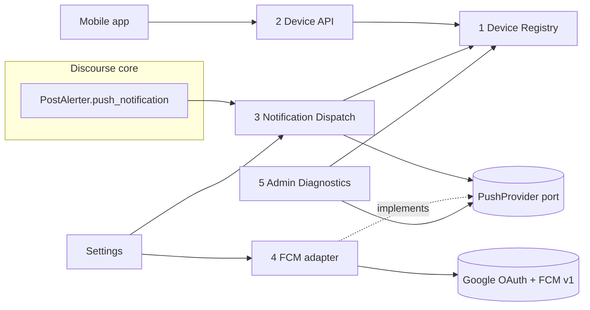
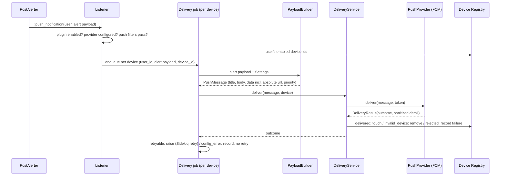

# mobile-push-v1

> Version 1.0 of the generic Discourse mobile push plugin: device registration API, delivery of Discourse push notifications to registered devices via FCM HTTP v1, self-healing delivery, deep-link payloads, and basic admin diagnostics (proposal section 43), built in vertical slices.

## Decisions Log

<!-- Add new at bottom. Never remove. -->

| Date | Decision | Reasoning | Alternatives Considered |
|------|----------|-----------|------------------------|
| 2026-10-01 | [Entry] Start at Level 1 (Capabilities), with a deep Level 3 for the Firebase integration | New third-party integration spanning several components (design-first calibration) | Start at Level 2 treating the proposal as agreed capabilities |
| 2026-10-01 | Blueprint covers full v1.0 scope (proposal section 43), implemented as vertical slices starting with the section 44 milestone | Avoids redesign between milestone and v1.0 while keeping delivery incremental | Blueprint only the first milestone |
| 2026-10-01 | [Level 1] Approved five capabilities: register devices, receive pushes, open content, self-healing delivery, admin configuration and diagnostics (incl. device browser and test send) | Matches proposal section 43; test send is the main diagnostic path | Simpler admin capability limited to dashboard problem check and logs |
| 2026-10-01 | [Level 1] No legacy `discourse-fcm-notifications` compatibility endpoint; Tziburia migrates to `POST /mobile-push/v1/devices` | Keeps the plugin generic; avoids a state-changing GET that bypasses CSRF; the app needs an update anyway to send app_id/version | Compatibility endpoint mimicking `GET /fcm_notifications/automatic_subscribe` |
| 2026-10-01 | [Level 1] Out of scope for v1.0: per-user push preferences, iOS-specific behaviour, collapsing, automatic stale-device cleanup (last-seen recorded only), multiple providers/projects, topic subscriptions | Proposal section 43 "later versions"; establish reliable delivery first | Include some of these in v1.0 |
| 2026-10-01 | [Level 2] Five components plus a Settings edge: Device Registry, Device API, Notification Dispatch, Push Provider (FCM adapter), Admin Diagnostics | Each has a confirmed need and >1 caller; maps 1:1 onto the hexagonal layers | Merge Device API into Device Registry (rejected: fat controller, admin test send needs registry without HTTP); fold Settings into FCM adapter (rejected: PayloadBuilder also needs settings) |
| 2026-10-01 | [Level 2] Diagnostics stored as per-device columns (last delivered, last failure, failure reason) plus a per-site summary in Redis (last success, last failure, last config error, invalidated count); no delivery history table | Answers every proposal section 18 question cheaply; proposal 47.6 favours lightweight logging | Dedicated `mobile_push_deliveries` history table (write per push, retention job, beyond v1.0) |
| 2026-10-01 | [Level 2] Notification hook is `DiscourseEvent :push_notification` (fired by `PostAlerter.push_notification` for post and chat alerts, after do-not-disturb, before push filters); the listener applies `push_notification_filters` itself | Canonical core push channel; covers chat; respects core push rules | `:post_notification_alert` (deprecated, posts only); Notification model callbacks (would duplicate notification rules) |
| 2026-10-01 | [Level 3] One delivery job per device, retried by Sidekiq's built-in exponential backoff on `retryable` outcomes | Retries can never duplicate a successful send; simplest retry semantics | One fan-out job per notification that re-enqueues only failed devices (custom bookkeeping, duplicate risk) |
| 2026-10-01 | [Level 3] Logout: the app unregisters (by id or by token); re-registration of a token by another user transfers ownership. Credential-linked auto-removal deferred | Matches proposal section 37; generic; no coupling to Discourse auth internals | Tie devices to the session token / User API key and remove on revocation |
| 2026-10-01 | [Level 3] Registration matching order: by token (update, transfer owner), else by (user, app_id, device_identifier) (token refresh), else create then evict least-recently-seen beyond the per-user cap | Idempotent registration; handles token rotation and shared devices | Unique on (user, app_id, platform) only (breaks multiple installs) |
| 2026-10-01 | [Level 3] Pushes are sent immediately; core's `push_notification_time_window_mins` delay is not mirrored | Mobile apps expect prompt delivery; keeps dispatch simple | Delay while the user is active on the site, like core web push |
| 2026-10-01 | [Level 3] FCM classification: 200 delivered; 404 UNREGISTERED and 400 INVALID_ARGUMENT naming `message.token` invalid_device; other 400 rejected; 401 refresh token and retry once then config_error; 403 PERMISSION_DENIED / SENDER_ID_MISMATCH / THIRD_PARTY_AUTH_ERROR config_error (never deletes devices); 429 retryable honouring Retry-After; 5xx/timeouts retryable | Follows Firebase error-code docs and proposal sections 12 and 20 | Delete tokens on any 400; treat SENDER_ID_MISMATCH as invalid_device (would wipe devices on project misconfig) |
| 2026-10-01 | [Level 3] Admin test send runs synchronously with tight timeouts through DeliveryService, and is recorded in the staff action log | Admin needs immediate feedback; same outcome handling as normal delivery; audit trail | Enqueue the test send and poll for its result |
| 2026-10-01 | [Level 4] Discourse alert payload keys are read only by `AlertMapper` (inbound adapter), producing a core `Alert` value object; `PayloadBuilder` works on `Alert` | Keeps PostAlerter/chat payload coupling in one adapter (architecture ambiguity signal resolved) | PayloadBuilder reading the raw payload hash |
| 2026-10-01 | [Level 4] Request field and column named `token` (not `fcm_token` / `registration_token`) | Provider-neutral naming per proposal section 17 | Proposal's `fcm_token` / `registration_token` |
| 2026-10-01 | [Level 4] Push `data` carries identifiers and an absolute `url` only, never post text; privacy mode affects title/body only. Full-mode titles reuse core `discourse_push_notifications.popup.*` translations | No text leaks via data; consistent, already-translated wording across locales | Plugin-owned title strings; including excerpt/username in data |
| 2026-10-01 | [Level 4] Mobile auth resolved: any standard Discourse auth via `ensure_logged_in` (session cookie + CSRF, User API keys, admin API keys), plus a `discourse-mobile-push:devices` User API key scope covering the device endpoints | Works for WebView apps (Tziburia) and native apps with narrowly scoped keys | Session only; no plugin-specific scope |
| 2026-10-01 | [Level 4] Admin JSON endpoints live under `/admin/mobile-push/...` (separate from the Ember page path `/admin/plugins/discourse-mobile-push/...`) | Avoids route clashes with the admin plugin page | JSON under `/admin/plugins/discourse-mobile-push/...` |
| 2026-10-01 | Requirement drift vs proposal: `fcm_token`/`registration_token` -> `token`; settings renamed to `mobile_push_*`, project id optional, added max devices / allowed app ids / high-priority types; added `DELETE /devices {token}`; invalid tokens always deleted. Not written to the proposal (user choice) | Provider neutrality (s17), Discourse conventions, validation, priority policy (s26), logout (s37), data minimisation (s22) | Record overrides in the proposal document |
| 2026-10-01 | Design approved at Level 4. Status set to approved -- ready for implementation. | All four levels approved and persisted; traceability verified | -- |

## Open Questions

None.

## Constraints

- Target Discourse `main`/tests-passed only; older versions pinned via `.discourse-compatibility`.
- FCM HTTP v1 only. No Firebase/Google gems (not `fcm`, `firebase-admin`, `googleauth`, `jwt`): service-account JWT signed with Ruby OpenSSL, HTTP via `Net::HTTP`.
- Hexagonal architecture per `.lattice/standards/architecture.md`: Firebase specifics stay in the FCM adapter; Discourse internals stay in adapters.
- Device ownership always comes from the authenticated Discourse user, never from a client-supplied `user_id`.
- FCM tokens are secrets: never logged or displayed in full (fingerprints only).
- Mobile API is versioned in the path (`/mobile-push/v1/...`).
- Push `data` values are strings and include an absolute `url` (required by the example consumer, Tziburia).
- Devices are deleted only on a device-specific signal (`invalid_device`); configuration or message errors never delete devices.
- Delivery never happens inside a normal web request; the only synchronous send is the bounded admin test send.

## Design: Level 1 -- Capabilities

1. **Register devices** -- a signed-in app user can register one or more devices (across one or more apps) to their Discourse account, keep each registration current when its push token changes, see their own devices, and remove them. Logging in on a new device adds a registration; it does not replace others.
2. **Receive push notifications** -- whenever Discourse would push-notify a user (replies, mentions, PMs, chat, etc.), each of their registered devices gets it promptly. Discourse's existing rules decide who is notified (including do-not-disturb and push filters). The site chooses how much text appears on a locked screen (full or generic) and which notification types are urgent.
3. **Open the right content** -- tapping a notification gives the app what it needs to open the relevant Discourse content: notification type, topic/post/chat identifiers, and an absolute URL.
4. **Self-healing delivery** -- temporary Firebase outages are retried with backoff; devices that uninstalled the app or hold invalid tokens are removed automatically; configuration problems stop retrying and are reported.
5. **Admin configuration and diagnostics** -- an administrator configures Firebase credentials and can see whether push is healthy (configuration status, device counts, app versions, last success/failure), browse devices with tokens masked, and send a test notification to a chosen device.

## Design: Level 2 -- Components

| # | Component | Layer | Responsibility | Discourse integration point |
|---|---|---|---|---|
| 1 | Device Registry | Core + persistence | Device lifecycle: idempotent register/update, ownership transfer on token re-registration, per-user cap, removal and invalidation. `Device` model on `mobile_push_devices`. | ActiveRecord, plugin migration |
| 2 | Device API | Inbound adapter (HTTP) | `/mobile-push/v1/devices` register / list own / delete own; validation; masked serialization; rate limiting | `ensure_logged_in`, `RateLimiter`, optionally `add_user_api_key_scope` |
| 3 | Notification Dispatch | Inbound adapter (event + job) + core | Listener applies push filters and enqueues a job; core builds a provider-neutral `PushMessage` (privacy, priority, deep link), fans out to the user's devices, applies outcomes | `DiscourseEvent :push_notification`, `push_notification_filters`, `Jobs::Base` |
| 4 | Push Provider (FCM adapter) | Port + outbound adapter | `PushProvider` contract; FCM HTTP v1 implementation: service account parsing, OpenSSL JWT, cached access token, send, error classification into neutral outcomes | `Discourse.redis`, `Net::HTTP` |
| 5 | Admin Diagnostics | Inbound adapters (admin) | Admin page (health summary, masked device browser, test send), admin JSON endpoints, dashboard problem check | `add_admin_route` (new show route), `addAdminPluginConfigurationNav`, `register_problem_check` |
| -- | Settings | Configuration edge | Sole reader of `mobile_push_*` settings; credentials in a `secret` setting shadowable by env | `SiteSetting`, `shadowed_by_global` |

Domain model: `Device` is the only aggregate (token unique site-wide, one owner, per-user cap). `PushMessage` and `DeliveryResult` are immutable value objects. No domain events.



## Design: Level 3 -- Interactions

### Flow 1: Register / list / unregister
1. App -> Device API: `POST /mobile-push/v1/devices` {platform, app_id, token, app_version, device_identifier?} using any standard Discourse auth.
2. Device API: rate-limit per user, validate, call Device Registry with (user, attributes):
   - token exists -> update it (transfer owner if a different user);
   - else matching (user, app_id, device_identifier) -> replace token;
   - else create, then evict least-recently-seen devices beyond the per-user cap;
   - always set `last_seen_at`, re-enable.
3. Device API -> App: device with token fingerprint only (201 created / 200 updated).
4. `GET` lists own devices; `DELETE /devices/:id` or `DELETE /devices` {token} removes own device only (404 otherwise).

### Flow 2: Notification dispatch

Every outcome also updates the per-site Redis summary.

### Flow 3: FCM adapter
1. Settings -> service account (project_id, client_email, private_key, token_uri); missing/invalid -> `config_error`.
2. Access token from Redis cache keyed by credential fingerprint; on miss sign RS256 JWT (OpenSSL), POST jwt-bearer grant to `token_uri`, cache for `expires_in` minus 5 minutes. Grant rejected -> `config_error`; 5xx/timeout -> `retryable`.
3. POST `https://fcm.googleapis.com/v1/projects/{id}/messages:send` {message: {token, notification, data, android: {priority}}} with Bearer token and short timeouts.
4. Classify (adapter only): 200 delivered; 404 UNREGISTERED / 400 INVALID_ARGUMENT on `message.token` invalid_device; other 400 rejected; 401 refresh + retry once then config_error; 403 PERMISSION_DENIED / SENDER_ID_MISMATCH / THIRD_PARTY_AUTH_ERROR config_error; 429 retryable (Retry-After); 5xx/timeouts retryable.

### Flow 4: Admin diagnostics
- Status: Settings state + Registry counts (platform, app/version, not seen for N days) + Redis summary.
- Device browser: paged, filter by username, masked tokens.
- Test send: synchronous, tight timeouts, via DeliveryService; result returned immediately; staff action logged.
- Problem check (dashboard load): enabled and (credentials missing/invalid or config error in last 24h) -> problem.

## Design: Level 4 -- Contracts

### Core value objects and port (`lib/discourse_mobile_push/`)
```ruby
module DiscourseMobilePush
  class Error < StandardError; end

  Alert = Data.define(
    :notification_type, :notification_type_id, :url,
    :topic_id, :topic_title, :post_number, :post_id, :channel_id,
    :username, :excerpt, :translated_title,
  )
  PushMessage = Data.define(:title, :body, :data, :priority)       # data: Hash{String=>String}; priority: :normal | :high
  DeliveryResult = Data.define(:outcome, :detail, :retry_after)   # outcome: :delivered | :invalid_device | :retryable | :config_error | :rejected
  #   predicates: delivered?, invalid_device?, retryable?, config_error?, rejected?

  class PushProvider # port
    def configured? = raise NotImplementedError                   # -> Boolean
    def deliver(message:, token:) = raise NotImplementedError     # -> DeliveryResult
  end

  def self.provider -> PushProvider
  def self.settings -> Settings
end
```

### Configuration edge
```ruby
class Settings
  def self.current -> Settings
  def enabled? -> Boolean
  def privacy_mode -> :full | :generic
  def high_priority_notification_types -> Array[String]
  def max_devices_per_user -> Integer
  def allowed_app_ids -> Array[String]
  def stale_device_days -> Integer
  def firebase_service_account_json -> String
  def firebase_project_id_override -> String?
  def base_url -> String
  def site_title -> String
end
```
Site settings: `mobile_push_enabled` (false), `mobile_push_firebase_service_account_json` (secret, textarea, shadowed_by_global), `mobile_push_firebase_project_id` (optional, shadowed_by_global), `mobile_push_privacy_mode` (full|generic), `mobile_push_high_priority_notification_types` (`private_message|mentioned|chat_mention`), `mobile_push_max_devices_per_user` (10), `mobile_push_allowed_app_ids` (empty), `mobile_push_stale_device_days` (60).

### Device Registry
```ruby
class Device < ActiveRecord::Base # table mobile_push_devices
  PLATFORMS = %w[android ios]
  MAX_TOKEN_LENGTH = 1024
  belongs_to :user
  scope :enabled
  def token_fingerprint -> String
  def stale?(days:) -> Boolean
  def record_delivery!(at:) -> void
  def record_failure!(reason:, at:) -> void
end
# columns: user_id, platform, app_id, device_identifier?, token (unique), app_version?, enabled,
#   last_seen_at, last_delivered_at?, last_failure_at?, last_failure_reason?, timestamps
# indexes: unique(token); unique(user_id, app_id, device_identifier) WHERE device_identifier IS NOT NULL; (user_id, last_seen_at)

class DeviceRegistry
  Registration = Data.define(:platform, :app_id, :token, :app_version, :device_identifier)
  Result = Data.define(:device, :created)
  def initialize(settings: DiscourseMobilePush.settings)
  def register(user:, registration:) -> Result   # raises ActiveRecord::RecordInvalid
  def unregister(user:, device_id: nil, token: nil) -> Boolean
  def invalidate(device:) -> void
end
```

### Notification Dispatch
```ruby
class NotificationListener; def self.call(user, payload) -> void; end          # inbound
class AlertMapper; def self.from_payload(payload, base_url:) -> Alert; end      # inbound
class PayloadBuilder                                                            # core
  def initialize(settings: DiscourseMobilePush.settings)
  def build(alert:, locale:) -> PushMessage
  def build_test(locale:) -> PushMessage
end
class DeliveryService                                                           # core
  def initialize(provider: DiscourseMobilePush.provider, registry: DeviceRegistry.new, diagnostics: DiagnosticsStore.new)
  def deliver(message:, device:) -> DeliveryResult
end
class DiagnosticsStore                                                          # outbound (Discourse.redis)
  Summary = Data.define(:last_success_at, :last_failure_at, :last_failure_detail,
                        :last_config_error_at, :last_config_error_detail, :invalidated_count)
  def record(result:, at: Time.zone.now) -> void
  def summary -> Summary
end
module ::Jobs::DiscourseMobilePush
  class DeliverToDevice < ::Jobs::Base # args: user_id, device_id, payload; retry: 5
    def execute(args) -> void          # raises RetryableDeliveryError on :retryable
  end
end
class RetryableDeliveryError < Error; attr_reader :retry_after; end
```

### FCM adapter (`lib/discourse_mobile_push/fcm/`)
```ruby
module Fcm
  class InvalidCredentials < Error; end
  ServiceAccount = Data.define(:project_id, :client_email, :private_key, :private_key_id, :token_uri)
  #   self.parse(json, project_id_override: nil) -> ServiceAccount; fingerprint -> String
  class HttpClient
    Response = Data.define(:status, :body, :headers)
    class NetworkError < Error; end
    def post_json(url:, body:, headers:) -> Response
    def post_form(url:, form:) -> Response
  end
  class AccessTokenSource
    class AuthError < Error; def retryable? -> Boolean; end
    def initialize(service_account:, http: HttpClient.new, cache: Discourse.redis)
    def token -> String
    def invalidate! -> void
  end
  class RequestBuilder; def self.build(message:, token:) -> Hash; end
  class ErrorClassifier; def self.classify(response:) -> DeliveryResult; end
  class Provider < PushProvider
    def initialize(settings: DiscourseMobilePush.settings, http: HttpClient.new)
  end
end
```

### Device API (mobile, versioned)
| Method | Path | Success | Errors |
|---|---|---|---|
| POST | `/mobile-push/v1/devices` {platform, app_id, token, app_version?, device_identifier?} | 201 / 200 {device} | 400, 403, 422 {errors}, 429 |
| GET | `/mobile-push/v1/devices` | 200 {devices} | 403 |
| DELETE | `/mobile-push/v1/devices/:id` | 204 | 403, 404 |
| DELETE | `/mobile-push/v1/devices` {token} | 204 | 403, 404 |

Device JSON: {id, platform, app_id, app_version, device_identifier, token_fingerprint, enabled, last_seen_at, created_at}. Validation: platform android|ios; app_id `[A-Za-z0-9][A-Za-z0-9._-]{0,254}` (+ allowlist); token 1..1024 chars, no whitespace; app_version <= 50; device_identifier <= 255. Auth: `ensure_logged_in` + User API key scope `discourse-mobile-push:devices`.

### Push data contract (string values)
`type` ("notification" | "test"), `notification_type`, `notification_type_id`, `url` (absolute; always present), and when present `topic_id`, `post_number`, `post_id`, `channel_id`. No post text in data.

### Admin API (staff) and problem check
| Method | Path | Returns |
|---|---|---|
| GET | `/admin/mobile-push/status.json` | {enabled, configured, project_id, configuration_error, summary, counts{total, enabled, stale, by_platform, by_app_version}} |
| GET | `/admin/mobile-push/devices.json?username=&page=` | {devices (+username), total_rows, page} |
| POST | `/admin/mobile-push/devices/:id/test.json` | {outcome, detail} |

`ProblemCheck::MobilePushConfiguration < ProblemCheck` -- `call -> Problem | nil`.

## Design Summary

- **Components and layers**: Device Registry (core + persistence: `Device`, `DeviceRegistry`), Device API (inbound HTTP: `/mobile-push/v1/devices`), Notification Dispatch (inbound `NotificationListener`, `AlertMapper`, `Jobs::DiscourseMobilePush::DeliverToDevice`; core `PayloadBuilder`, `DeliveryService`; outbound `DiagnosticsStore`), Push Provider (port `PushProvider`; outbound `Fcm::*`), Admin Diagnostics (admin JSON API, Ember page, `ProblemCheck::MobilePushConfiguration`), Settings (configuration edge).
- **Key contracts**: `PushProvider#deliver(message:, token:) -> DeliveryResult` with neutral outcomes; `DeviceRegistry#register/unregister/invalidate`; `PayloadBuilder#build(alert:, locale:)`; `DeliveryService#deliver(message:, device:)`; versioned mobile API and push `data` contract (identifiers + absolute `url`).
- **Architectural constraints**: Firebase specifics only in `fcm/`; Discourse alert keys only in `AlertMapper`; settings only via `Settings`; delivery only in jobs (bounded admin test send excepted); devices deleted only on `invalid_device`; no new gems.
- **Domain model**: single `Device` aggregate (token unique site-wide, one owner, per-user cap); immutable `Alert`, `PushMessage`, `DeliveryResult` value objects; no domain events.
- **Resolved during design**: mobile auth (all standard Discourse auth + plugin User API key scope); diagnostics storage (device columns + Redis summary); retry granularity (one job per device); logout (app unregisters, ownership transfer); no legacy compatibility endpoint.
- **Drift check**: differences from the proposal recorded in the Decisions Log only (user choice).
- **Suggested slice order**: (1) skeleton + settings + Device model/registry + Device API; (2) FCM adapter (service account, access token, send, classification); (3) listener + mapper + payload builder + delivery job/service (first end-to-end milestone); (4) diagnostics store + admin API + problem check; (5) admin Ember page; (6) docs and release files.

## Key Files

| Path | Role |
|---|---|
| `Proposed Generic Discourse Mobile Push Notification Plugin.md` | Source proposal (requirement doc) |
